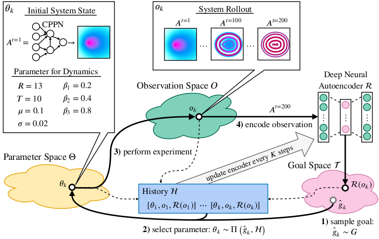
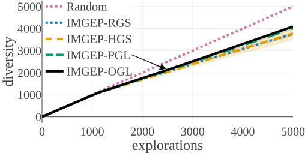
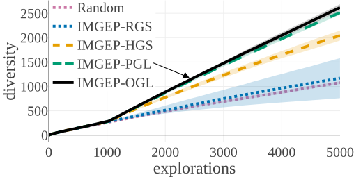
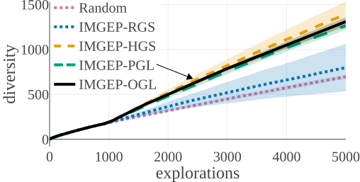
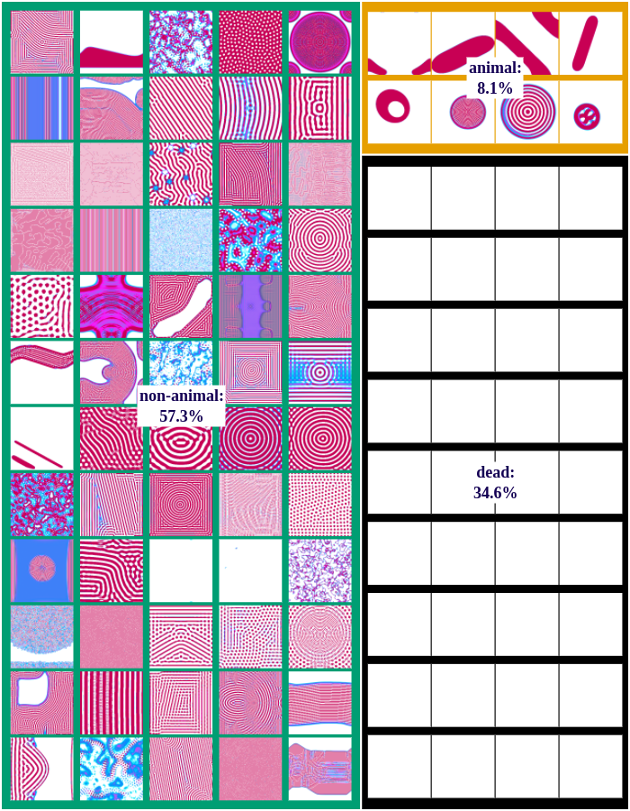
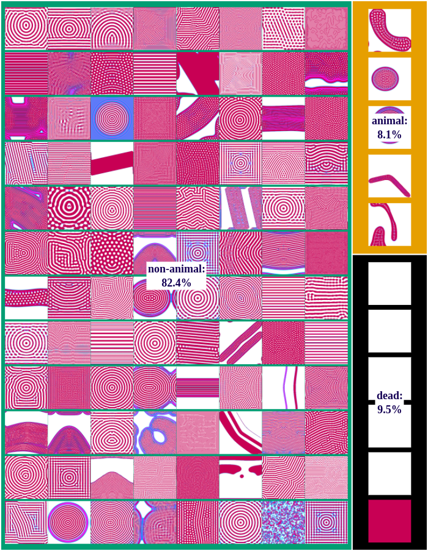
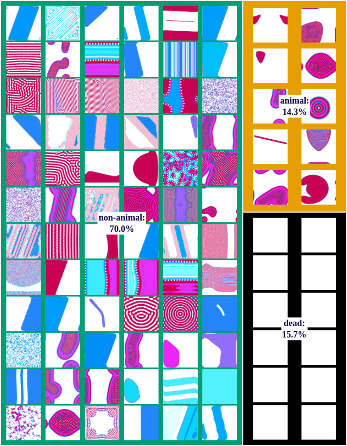
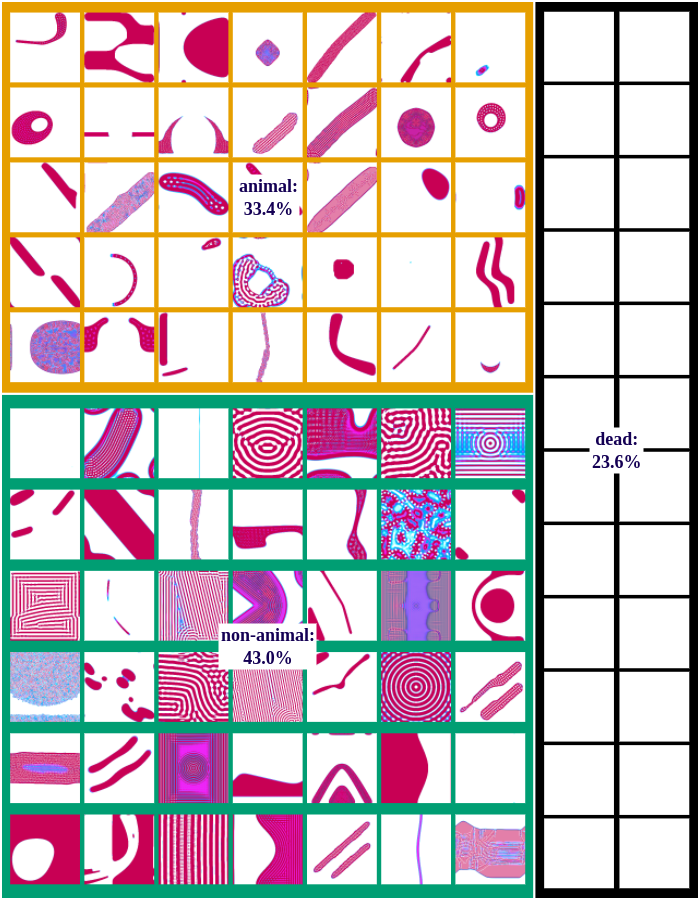
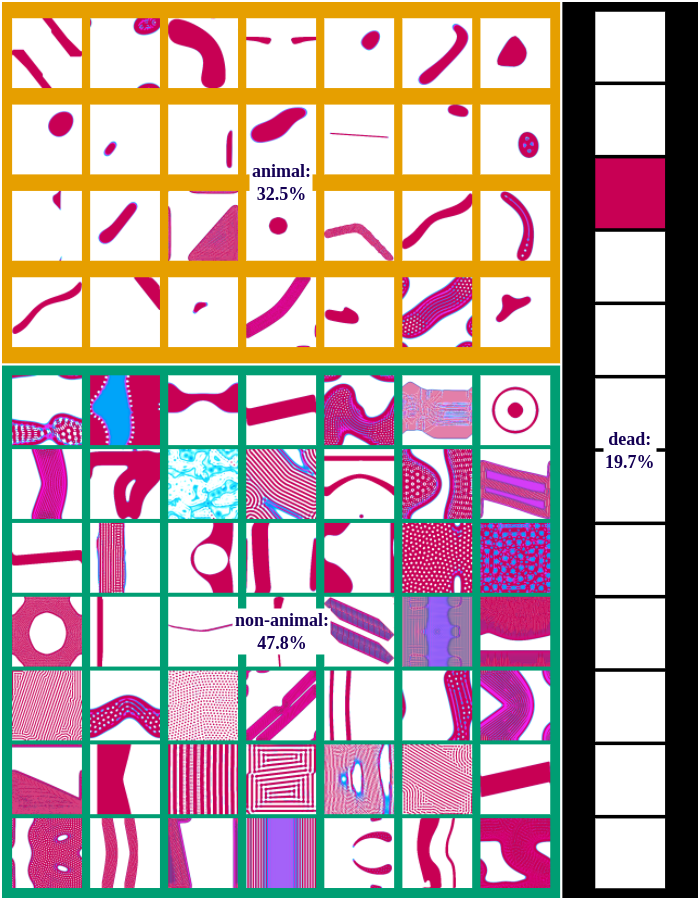

## Intrinsically Motivated Discovery of   Diverse Patterns in Self-Organizing Systems
[Chris Reinke](http://www.scirei.net), [Mayalen Etcheverry](https://mayalenetcheverry.com), [Pierre-Yves Oudeyer](http://www.pyoudeyer.com/) 
{: style="font-size: 140%; text-align: center;"}

November 2019 
{: style="font-size: 140%; text-align: center;"}

[[Download the Paper]](./assets/media/paper/Automated_Discovery.pdf) &nbsp; [[Read the Blogpost]](https://developmentalsystems.org/intrinsically_motivated_discovery_of_diverse_patterns) &nbsp; [[Download the Source Code]](https://github.com/flowersteam/automated_discovery_of_lenia_patterns)
{: style="color:gray; font-size: 140%; text-align: center;"}

In many complex dynamical systems, artificial or natural, one can observe selforganization of patterns emerging from local rules. 
Cellular automata, like the Game of Life (GOL), have been widely used as abstract models enabling the study of various aspects of self-organization and morphogenesis, such as the emergence of spatially localized patterns. However, findings of self-organized patterns in
such models have so far relied on manual tuning of parameters and initial states, and on the human eye to identify “interesting” patterns. 
In this paper, we formulate the problem of automated discovery of diverse self-organized patterns in such high-dimensional complex dynamical systems, as well as a framework for experimentation and evaluation. 
Using a continuous GOL as a testbed, we show that recent intrinsically-motivated machine learning algorithms (POP-IMGEPs), initially developed for learning of inverse models in robotics, can be transposed and used in this novel application area. 
These algorithms combine intrinsically motivated goal exploration and unsupervised learning of goal space representations. 
Goal space representations describe the “interesting” features of patterns for which diverse variations should be discovered. 
In particular, we compare various approaches to define and learn goal space representations from the perspective of discovering diverse spatially localized patterns. 
Moreover, we introduce an extension of a state-of-the-art POP-IMGEP algorithm which incrementally learns a goal representation using a deep auto-encoder, and the use of CPPN primitives for generating initialization parameters. 
We show that it is more efficient than several baselines and equally efficient as a system pre-trained on a hand-made database of patterns identified by human experts.

* * *

This page provides information about:
 * POP-IMGEPs
 * Lenia, the target system used for the experiments
 * Examples of patterns that could be identified with help of POP-IMGEPs
 * A video of our software to visualize the identified patterns and goal spaces
 * An interactive tool to visualize the different results presented in the paper

* * *

###  Intrinsically Motivated Goal Exploration Processes (POP-IMGEPs)

An POP-IMGEP or shorter IMGEP is a sequence of experiments that explore the parameters of a system by targeting self-generated goals. 
It aims to maximize the diversity of observations from that system within a budget of n experiments.

The systems are defined by three components.
A parameterization space corresponding to their controllable parameters.
An observation space where an observation is a vector representing all the signals captured from the system.
Finally, an unknown environment dynamic which maps parameters to observations.

{: .center-image }

To explore a system, an IMGEP defines a goal space that represents relevant features of its observations.
For a robot that has to manipulate objects and observes them with a video camera, those features could be the object positions.
From this goal space a goal is sampled by a goal sampling distribution.
For the robot example this would correspond to a sampling of positions to where the robot should move the objects.
Then, a parameter is chosen that should be explored in order to reach the goal.
Usually the parameter selection and in some cases the goal sampling distribution take into account previous explorations which are stored in a history.
After a parameter is selected it is explored on the system and the outcome observed.
Based on the observation the actually reached goal is computed and together with its corresponding parameter and observation stored in history.
The exploration process is repeated until a certain number of steps or another constraint is reached.
Because the sampling of goals and parameters depend on a history of explored parameters, an initial set of parameters are randomly sampled and explored before the goal exploration process starts.

Depending on the algorithmic instantiation of this architecture, different goal and parameter sampling mechanisms can be used.
For this paper we chose for both simple approaches.
Goals are sampled from a uniform distribution over the goal space.
Parameters are chosen by selecting for a given goal the parameter from the history whose reached goal has the shortest distance in the goal space to the given goal.
This parameter is then mutated to by a random process.

* * *
### Target System: Lenia - A Continuous Cellular Automaton
We tested different IMGEP approaches on Lenia [[arXiv]](https://arxiv.org/abs/1812.05433), a continuous cellular automaton similar to Conway's Game of Life.

The following video by its creator shows possible patterns that can be generated with Lenia:

<iframe width="800" height="405" src="https://www.youtube.com/embed/iE46jKYcI4Y" frameborder="0" allowfullscreen></iframe>
 
 
<a href="https://chakazul.github.io/Lenia/JavaScript/Lenia.html">
Explore Lenia online: <small>https://chakazul.github.io/Lenia/JavaScript/Lenia.html</small>  </a>

* * *
### Discovered Patterns

We differentiate between dead, animal and non-animal patterns in Lenia. 
A pattern is dead if the activity of all cells is either 0 or 1.
Alive patterns are separated into animals and non-animals. 
Animals resemble microscopic animals such as bacteria. 
We classify all patterns as animals if they have connected areas of positive activity which are finite, i.e. which do not infinitely cross several borders (Lenia's borders are connected and form a ball). 
All other patterns are non-animals whose activity usually spreads over the whole state space.

We compared the algorithms by the diversity of patterns they discovered.
The diversity is measured by the number of explored bins in the parameter and a statistic space.
The following figures compare the diversity between the different algorithms.
They show that IMGEP approaches are able to find a higher diversity of patterns, although a random parameter search has a higher diversity in the parameter space.

|Diversity in Parameter Space                                  | Diversity in Statistic Space                                  |
| | |

| Statistic Space Diversity for Animals                             |  Statistic Space Diversity for Non-Animals                        |
| | |

Random Exploration samples parameters randomly.
IMGEP-RGS has a goal space which uses a VAE encoder intialized with with random weights.
IMGEP-HGS has a  goal space which uses hand-defined features.
IMGEP-PGL and the IMGEP-OGL have a goal space which was learned via a variational autoencoder. 
For IMGEP-PGL, the training is done before exploration starts on a precollected dataset. 
For IMGEP-OGL, the training is done incrementally during the exploration.

The following figures show examples of discovered patterns of the different algorithms.
A dataset with all discovered animal and non-animal patterns can be download [here](https://drive.google.com/file/d/1ZhVG2_uTLaT4SMqj0wKTKn568Y2XaypU/view?usp=sharing) (1.8GB).

**Random-Exploration**
{: style="text-align: center;"}
{: .center-image }

**IMGEP-RGS**
{: style="text-align: center;"}
{: .center-image }

**IMGEP-HGS**
{: style="text-align: center;"}
{: .center-image }

**IMGEP-PGL**
{: style="text-align: center;"}
{: .center-image }

**IMGEP-OGL**
{: style="text-align: center;"}
{: .center-image }

The following video shows some example patterns that have been discovered automatically during one exploration experiment with the IMGEP-OGL algorithm:
<iframe width="800" height="405" src="https://youtube.com/embed/qxxs_Sga1xQ" frameborder="0" allowfullscreen></iframe>

 
 

* * *
#### Visualisation of Learned Goal Spaces

The results of the exploration can be visualized by a two-dimensional reduction of the goal space.
The following video shows the visualization for the IMGEP-OGL and IMGEP-HGS results.

<iframe width="800" height="405" src="https://youtube.com/embed/oMh2CGb-86M" frameborder="0" allowfullscreen></iframe>

 
 

* * *
#### Interactive tool to explore our results
We provide access to all the discovered patterns for all the repetitions of the different IMGEP algorithms from the main paper. For each algorithm, the projections are computed from the embeddings in their respective goal spaces. 

Click on the link below to discover the results. You will be redirected toward tensorflow's embedding projector tool where we loaded our results. 

From there, you can browse the different discoveries and:
* select the desired IMGEP algorithm and repetition in the DATA column on the left
* filter the results by label by:
  * entering the label name ("animal", "other", "dead") in the *Search* entry in the right column
  * clicking on the *Isolate Selection* button above
  * double-click on the screen to remove the labels
* view the results under different projections: *UMAP*, *T-SNE* or *PCA* in the bottom-left menu

<a href="https://projector.tensorflow.org/?config=https://raw.githubusercontent.com/intrinsically-motivated-discovery/intrinsically-motivated-discovery.github.io/master/assets/media/tensorboard/projector_config.json">
Explore the results online: <small> https://projector.tensorflow.org/?config=https://raw.githubusercontent.com/intrinsically-motivated-discovery/intrinsically-motivated-discovery.github.io/master/assets/media/tensorboard/projector_config.json </small>  </a>

 
 

* * *
### Acknowledgement
We would like to thank Bert Chan for the valuable discussions and for providing the source code of Lenia. 
